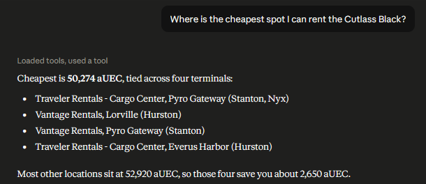
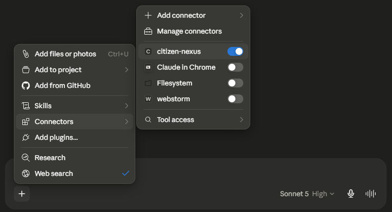
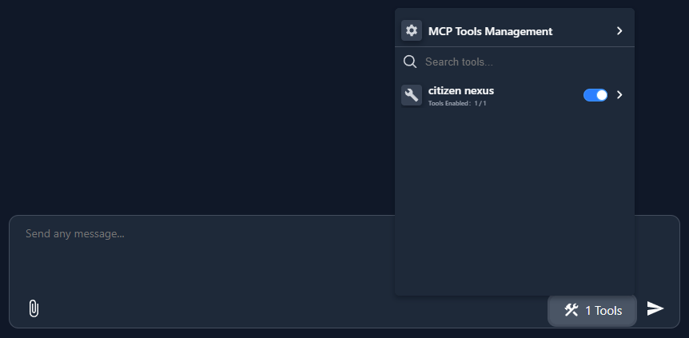

# Citizen Nexus

---

An MCP server that fetches data from the Star Citizen wiki and UEX.

## Description

---

This project is an [MCP server](https://modelcontextprotocol.io/docs/getting-started/intro) that gathers data from
the [Star Citizen Wiki](https://starcitizen.tools/) and [UEX](https://uexcorp.space/) via their respective APIs,
letting new and veteran players alike look up item and vehicle purchase locations, commodity prices, and more
directly from their favorite LLM. Plug it into any MCP compatible client accepting stdio, such as Claude.

## ⚙️ Exposed tools

### `search_vehicles`

Finds Star Citizen flight-ready ships and ground vehicles by name. Returns matching vehicles with key details
(manufacturer, classification, crew, cargo, quantum travel) along with any in-game purchase or rental listings
(terminals, locations, UEC prices).

**Parameters:**

- `query` (string, required): Full or partial vehicle name, e.g. "Constellation" or "Drake Cutlass Black"

<details>
<summary>Prompt example</summary>



</details>

## 📝 Requirements

Node >= 24.16.0

You will need an MCP client installed on your computer. I recommend
the [Claude desktop app](https://claude.com/download).
If you run out of usage too quickly, you can install [Dive](https://github.com/OpenAgentPlatform/Dive) instead and
use a Gemini API key from [Google AI Studio](https://ai.google.dev/gemini-api/docs/api-key) (500 requests/day with
the Gemini 3.1 Flash Lite model).

> ⚠️ **Note**: Citizen Nexus was built mainly with Claude in mind. As more tools and use cases are added, other models
> might give unexpected results.

## 📦 Installation and setup

---

Start by cloning the repository and navigating into it, then run:

`npm install && npm run build`

Next, take note of the full path to the `dist/index.js` file.

### Claude Desktop App

Edit the `claude_desktop_config.json` file. You can find its location in the Claude app under
`Settings > Developer > Edit Config`. Add the following configuration, replacing `path/to/index.js` with the path
you identified above:

```json
{
  "mcpServers": {
    "citizen-nexus": {
      "command": "node",
      "args": [
        "path/to/index.js"
      ]
    }
  }
}
```

Save the file and restart the Claude desktop app. Before using the server in a chat, make sure it is enabled:



### Dive

After setting up your model provider, open the MCP Tools Management tab in the settings and click
`Add / Edit MCP Config`. Paste the following configuration into the JSON field, replacing `path/to/index.js` with
the path you identified above:

```json
{
  "mcpServers": {
    "citizen nexus": {
      "transport": "stdio",
      "enabled": true,
      "command": "node",
      "args": [
        "path/to/index.js"
      ]
    }
  }
}
```

Click `Save`. Before using the server in a chat, make sure it is enabled:



> ℹ️ **Note**: If you run into issues with the `node` command, try replacing it with its full path, which you can
> find using this command: `Get-Command node`.

## Usage

---

## Support this project

---

If you find this tool useful, you can buy me a coffee 😊

<a href='https://ko-fi.com/J0V120R4A1' target='_blank'></a>

## 📌 Acknowledgements and disclaimers

---

This project uses data from the following community APIs:

**[UEX Corporation](https://uexcorp.space/):** Provides Star Citizen trade and market data. Use of this tool requires
your own UEX API key and compliance with the [UEX Terms of Service](https://uexcorp.space/about/terms).

**[Star Citizen Wiki API](https://api.star-citizen.wiki):** Star Citizen general game data. Use of this tool requires
compliance with their [usage terms](https://api.star-citizen.wiki/developers).


**This is a fan-made tool and is not affiliated with or endorsed by Cloud Imperium Games or Roberts Space Industries.
Star
Citizen®, Roberts Space Industries®, and Cloud Imperium® are registered trademarks of Cloud Imperium Rights LLC and
Cloud Imperium Rights Ltd.**

**Commercial use is not permitted under
the [RSI Fandom FAQ](https://support.robertsspaceindustries.com/hc/en-us/articles/360006895793-Star-Citizen-Fankit-and-Fandom-FAQ).
**
